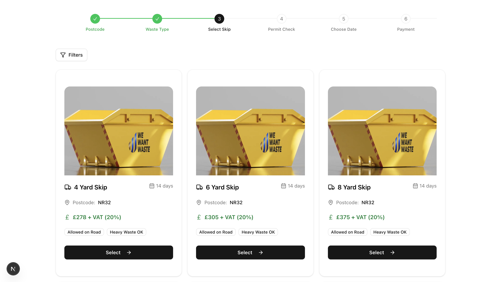

```
# ♻️ Skip Size Selector Redesign – REMWaste Coding Challenge

This is a redesigned version of the **“Choose Your Skip Size”** page for [REMWaste's booking platform](https://wewantwaste.co.uk/), built as part of a front-end development challenge.

The aim of this project is to **improve the UI/UX**, **modernize the look and feel**, and **maintain full functionality** using clean, responsive, and maintainable React code.

---

## 🚀 Live Demo

- 🔗 **Live Preview:** [https://select-skip.vercel.app/](#)
- 💻 **GitHub Repository:** [https://github.com/bemnet884/select_skip](#)
- ▶️ **Demo Video:** [https://drive.google.com/file/d/1r-Lvye_hbd91jwzCIRt5IBg5-IELg841/view?usp=sharing](#)

---

## 🧰 Tech Stack

| Technology       | Description |
|------------------|-------------|
| **React 18**     | Component-based frontend architecture |
| **Next.js (App Router)** | Server rendering, routing, and API handling (used **Server Actions** to fetch skip data) |
| **TypeScript**   | Type-safe development |
| **Tailwind CSS** | Utility-first responsive styling |
| **shadcn/ui**    | Accessible headless UI components like `Popover`, `Sheet`, and `Dialog` |
| **Lucide Icons** | Clean and scalable SVG icons |

---

## 📸 Screenshots

| Desktop | Mobile |
|--------|--------|
|  |  |

---

## 🧩 Features

### 🧭 Sticky Blurry Stepper Navigation

- Displays the current booking progress (Step 3: Choose Your Skip)
- **Sticky at the top** with a **backdrop blur effect** to maintain context while scrolling
- Responsive layout across devices

---

### 📦 Skip Options Display

- Data fetched from:
```

[https://app.wewantwaste.co.uk/api/skips/by-location?postcode=NR32\&area=Lowestoft](https://app.wewantwaste.co.uk/api/skips/by-location?postcode=NR32&area=Lowestoft)

````
- Each skip card includes:
- Name
- Size
- Image
- Price
- Allowed on Road indicator
- Heavy Waste Allowed indicator
- "Select this Skip" button

- On selection:
- A **modal** appears for confirmation

---

### 🎛️ Filtering System

#### ✅ Features:
- Filter by:
- **Skip Size**
- **Price Range**
- **Allowed on Road**
- **Allows Heavy Waste**
- **Reset Filters** button to clear all active filters

#### 📱 Responsive Filter UI:
- **Mobile**: Opens in a `Sheet` (bottom drawer)
- **Desktop**: Opens in a `Popover`

---

### 💡 User Experience (UX) Enhancements

- Fully responsive layout
- Mobile-first design considerations
- Visual hierarchy optimized for clarity
- Accessible component usage
- Fast interactions (no reloads)
- Smooth transitions

---

## 📦 Installation & Running Locally

```bash
# Clone the repository
git clone https://github.com/bemnet884/select_skip.git
cd select_skip

# Install dependencies
npm install

# Start the development server
npm run dev
````

---

## 📌 Notes

* This project focuses **only on Step 2** of the booking process: **Skip Size Selection**.
* Initial steps like postcode, address, or waste type are mocked or pre-filled.
* The API used is hardcoded to:

  * `postcode=NR32`
  * `area=Lowestoft`

---

## 🎥 Demo Video

Watch how the interface works across mobile and desktop:
📺 **Desktop Demo:** [https://drive.google.com/file/d/1r-Lvye_hbd91jwzCIRt5IBg5-IELg841/view?usp=sharing](#)
📺 **Mobile Demo:** [https://drive.google.com/file/d/1wM2z1RCoKn5EO2K5iqmA949bL2ziv1Sa/view?usp=sharing](#)

---

## 🙋 Contact

**Developer:** Bemnet (Bem)
📧 Email: \[[hannabemnet94@gmail.com](mailto:hannabemnet94@gmail.com)]
🌐 LinkedIn: [www.linkedin.com/in/bemnetbeyene](#)

---

## 📝 License

This project was created solely for the purpose of the REMWaste front-end coding challenge. Not intended for production or commercial use.

---

Thank you REMWaste for the opportunity!

```