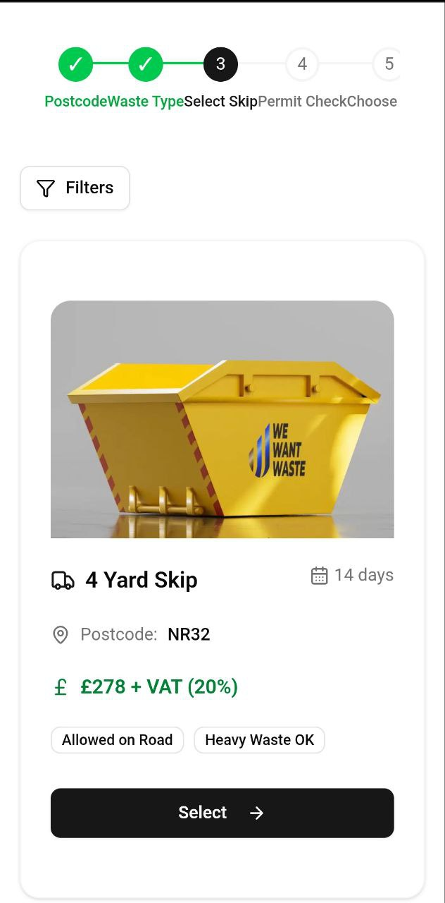

# ♻️ Skip Size Selector Redesign – REMWaste Coding Challenge

This is a redesigned version of the **“Choose Your Skip Size”** page for [REMWaste's booking platform](https://wewantwaste.co.uk/), built as part of a front-end development challenge.

The goal of this project is to **modernize the UI/UX**, **enhance responsiveness**, and ensure a clean, functional, and intuitive user experience using a modern tech stack.

---

## 🚀 Live Demo

- 🔗 **Live Preview:** [View on Vercel](https://select-skip.vercel.app/)
- 💻 **GitHub Repository:** [View Code on GitHub](https://github.com/bemnet884/select_skip)
- ▶️ **Demo Video:** [Watch Full Demo](https://drive.google.com/file/d/1r-Lvye_hbd91jwzCIRt5IBg5-IELg841/view?usp=sharing)

---

## 🧰 Tech Stack

| Technology        | Description |
|------------------|-------------|
| **React 18**      | Component-based frontend architecture |
| **Next.js (App Router)** | Server rendering and routing with Server Actions to fetch API data |
| **TypeScript**    | Type-safe development |
| **Tailwind CSS**  | Utility-first responsive styling |
| **shadcn/ui**     | Accessible UI primitives (e.g., `Popover`, `Sheet`, `Dialog`) |
| **Lucide Icons**  | Elegant and customizable SVG icon set |

---

## 📸 Screenshots

| Desktop | Mobile |
|--------|--------|
|  |  |

---

## 🧩 Features

### 🧭 Sticky Blurry Stepper Navigation

- Displays booking progress (**Step 3: Choose Your Skip**)
- **Sticky header with backdrop blur** for better context and smooth experience
- Works seamlessly on desktop and mobile

---

### 📦 Skip Options Display

- Skips are fetched dynamically from a remote API:
  - [Fetch Skip API](https://app.wewantwaste.co.uk/api/skips/by-location?postcode=NR32&area=Lowestoft)
- Each skip card displays:
  - Name
  - Size
  - Image
  - Price
  - Allowed on Road badge
  - Heavy Waste Allowed badge
  - **“Select this Skip”** button

- On selecting a skip:
  - A **modal** appears for confirmation before moving forward

---

### 🎛️ Filtering System

#### ✅ Key Filters:
- **Skip Size**
- **Price Range**
- **Allowed on Road**
- **Allows Heavy Waste**
- **Reset Filters** to clear all selections

#### 📱 Responsive Filter Behavior:
- **Mobile:** Filters open in a `Sheet` (bottom drawer)
- **Desktop:** Filters open in a `Popover`

---

### 💡 UX Highlights

- Fully responsive layout
- Optimized for mobile and desktop
- Clear visual hierarchy
- Accessible keyboard navigation
- Fast, smooth interactions

---

## 📦 Installation & Running Locally

```bash
# Clone the repository
git clone https://github.com/bemnet884/select_skip.git
cd select_skip

# Install dependencies
npm install

# Start the development server
npm run dev
````

---

## 📌 Notes

* This app focuses **only on Step 3** of the booking flow: **Skip Size Selection**
* Earlier steps (postcode, address, waste type) are mocked or prefilled
* Current API query is hardcoded to:

  * `postcode=NR32`
  * `area=Lowestoft`

---

## 🎥 Demo Videos

* 📺 **Desktop Walkthrough:** [Watch on Google Drive](https://drive.google.com/file/d/1r-Lvye_hbd91jwzCIRt5IBg5-IELg841/view?usp=sharing)
* 📱 **Mobile Walkthrough:** [Watch on Google Drive](https://drive.google.com/file/d/1wM2z1RCoKn5EO2K5iqmA949bL2ziv1Sa/view?usp=sharing)

---

## 🙋 About the Developer

**👨‍💻 Bemnet Beyene (Bem)**
📧 [hannabemnet94@gmail.com](mailto:hannabemnet94@gmail.com)
🔗 [LinkedIn Profile](https://www.linkedin.com/in/bemnetbeyene)

---

## 📝 License

This project is developed for the REMWaste front-end coding challenge.
Not intended for commercial or production use.

---

**Thanks to REMWaste for this fun and rewarding opportunity!**
